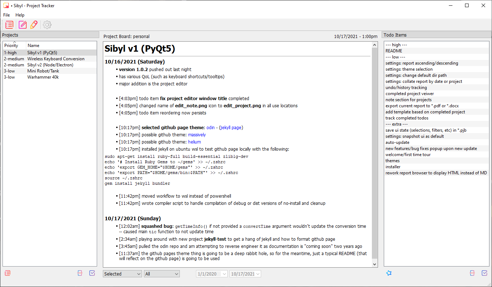

<table width="100%">
    <tr valign="middle";>
        <td width="75px"></td>
        <td><h1>Sibyl - A Simple, No Nonsense Project Tracker</h1></td>
    </tr>
</table>

 

# Introduction

## Motivation

In my day to day, I have many of projects that I _could_ be working on and that I would often _love_ to be working on, however, I also have a terrible memory. This has led me to search for and try just about every major (and some not so major) project/todo tracker softwares over the years. A few of these include:

- [Monday](https://monday.com/)
- [Jura](https://www.atlassian.com/software/jira)
- [Asana](https://asana.com/)
- [Trello](https://trello.com/en-US)
- [Microsoft One Note](https://www.onenote.com/download)
- [Microsoft Planner](https://tasks.office.com/)
- [Slack](https://slack.com/)
- [Kyber bot for Slack](https://joebobs0n-engineering.slack.com/apps/A0EP69E58-kyber?tab=more_info)
- [MySQL Workbench](https://www.mysql.com/products/workbench/)
- and many others...

By trying so many different solutions to the same problem (help track projects) is that many of these pieces of software often forget to support me and instead demand that I support them. What I mean by this is that I ended up spending more time configuring and using the software (often getting frustrated in the process) rather than having the software help me in any way.

While these resources above are very powerful in their own right, I feel that in most cases, with the obvious exceptions, in order to implement fancy, more robust features, the basic ones would get unnecessarily complicated. This led to fatigue and eventual loss of interest in a given project due to all of my energy went toward fighting an unnecessary battle instead of into working.

 

## Solution

At the end of the day, I realized that what I needed was a piece of software that would keep track of my projects by taking simple settings and then reporting the sorted data without all the fancy features such as team projects or [Gantt charts](https://en.wikipedia.org/wiki/Gantt_chart). This way, at a glance, I could see all of my projects, documentation/notes, and todo items in one place.

Since I am opinionated enough on the subject and masquerade as someone that can code, I decided to make my own piece of sotware to fill the need. Enter Sibyl (named after the [Oracles of antiquity](https://en.wikipedia.org/wiki/Sibyl)). If you don't get the reference, that's okay.

Explanation of the UI can be found in the [Getting Started](#getting-started) section.

It may be a little meta, but I am using Sibyl to track my progress/todo items for Sibyl. What better test case? If you want, you can read all of the todo items for this project to see what features may be coming in the future, but I make no promises.

 

# Table of Contents
- [Introduction](#introduction)
  - [Motivation](#motivation)
  - [Solution](#solution)
- [Table of Contents](#table-of-contents)
- [Installation](#installation)
  - [Recommended](#recommended)
  - [From Source](#from-source)
- [Getting Started](#getting-started)
- [Detailed Documentation](#detailed-documentation)
- [Resources](#resources)
- [License](#license)

 

# Installation

Currently, there are two different ways of "installing" Sibyl:

- downloading and extracting the `sibyl-no-install-v*.zip`: quick, easy, and recommended.
- compiling from source: if you don't like how I did something and can navigate my spaghetti code to make the fix, this is your solution.

 

## Recommended

1. Navigate to the [releases page](https://github.com/joebobs0n/project-tracker/releases)
2. Dowload the newest `sibyl-no-install-v*.zip`
3. Extract the contents to a desired location
   - The user account must have write permissions to the directory
   - It is recommended to extract to `~/Documents/Sibyl`
   - If the user does not have write permission in the extracted directory, the sotware will inform the user and provide instructions to reslove the issue.
4. [Optional] Create a shortcut of `Sibyl.exe` to the desktop or taskbar as the program will not show up in the start menu (hence `no-install`).

 

## From Source

1. Work on WSL or Linux machine if you want to use the compiler script (see step 7)
2. Ensure that you have [`pyinstaller`](https://pypi.org/project/pyinstaller/)
3. Acquire the code base either through [`git clone`](https://githubm.com/joebobs0n/project-tracker) or downloading the desired version `Source Code.zip` from the [releases page](https://github.com/joebobs0n/project-tracker/releases)
4. Resolve any missing package dependancies
5. Make desired modifications
6. Change version number/name in `src/magic_numbers.py` to differentiate your code
7. Compile the project
   - If working on WSL or Linux:
     1. Run `compile.py`; check out `compile.py -h` for options
     2. All files (based on `compile.py` options) will be in `dist/.`
   - If working on Windows:
     1. Run `pyinstaller.exe --onefile --name Sibyl --icon .\icons\main.ico .\_main.py` with any additional desired flags/options
     2. Copy `src\*.ui` to `dist\src\.`
     3. Copy `icons\*` to `dist\icons\.`
     4. Your distribution files will now be in `dist\.`

 

# Getting Started

First things first, this major version of Sibyl is developed to only work on Windows. Currently there are plans to make another major version that moves away from `PyQt5` to `Node` and `Electron` which has better capabilities to support other operating systems (Windows, MacOS, Linux, Android, iOS).

 

# Detailed Documentation

 

# Resources

- [Python3](https://www.python.org/downloads/)
- [PyQt5](https://pypi.org/project/PyQt5/)
- [Candy Icons](https://github.com/EliverLara/candy-icons)

 

# License

 
