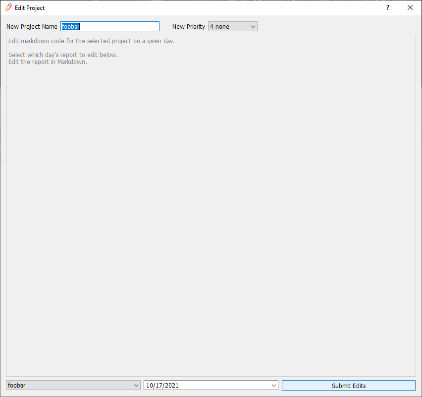

<table width="100%">
    <tr>
        <td width="75px"></td>
        <td><h1>Sibyl - A Simple, No Nonsense Project Tracker</h1></td>
    </tr>
</table>

# Contents
- [Contents](#contents)
- [Introduction](#introduction)
  - [Motivation](#motivation)
  - [Solution](#solution)
- [Installation](#installation)
  - [Recommended](#recommended)
  - [From Source](#from-source)
- [First Time Launch](#first-time-launch)
- [UI Tour](#ui-tour)
  - [Main Window](#main-window)
  - [New Project Dialog](#new-project-dialog)
    - [Adding a Project](#adding-a-project)
    - [Templates](#templates)
  - [Add Note Dialog](#add-note-dialog)
    - [Input Area](#input-area)
    - [Project Selector](#project-selector)
  - [Edit Project Dialog](#edit-project-dialog)
- [Known Issues](#known-issues)
- [Resources](#resources)
- [License](#license)

# Introduction

## Motivation

In my day to day, I have many projects that I _could_ be working on and that I would often _love_ to be working on, however, I also have a terrible memory. This has led me to search for and try just about every major (and some not so major) project/todo tracker solutions over the years. A few of these include:

- [Monday](https://monday.com/)
- [Jura](https://www.atlassian.com/software/jira)
- [Asana](https://asana.com/)
- [Trello](https://trello.com/en-US)
- [Microsoft One Note](https://www.onenote.com/download)
- [Microsoft Planner](https://tasks.office.com/)
- [Slack](https://slack.com/)
- [Kyber bot for Slack](https://joebobs0n-engineering.slack.com/apps/A0EP69E58-kyber?tab=more_info)
- [MySQL Workbench](https://www.mysql.com/products/workbench/)
- and many others...

By trying so many different solutions to the same problem (help track projects), I have found that many available products often forget to support me and instead demand that I support them. What I mean by this is that I ended up spending more time configuring and using the software (often getting frustrated in the process) rather than having the software help me in any meaningful way.

While these resources above are very powerful in their own right, I feel that in most cases, with the obvious exceptions, in order to implement fancy, more robust features, the basic ones often get unnecessarily complicated. This led to fatigue and eventual loss of interest in a given project due to all of my energy going toward fighting an unnecessary battle instead of into working.

## Solution

At the end of the day, I realized that what I needed was a piece of software that would keep track of my projects by taking simple settings and then reporting the sorted data without all the fancy features such as team projects or [Gantt charts](https://en.wikipedia.org/wiki/Gantt_chart). This way, at a glance, I could see all of my projects, documentation/notes, and todo items in one place.

Since I am opinionated enough on the subject and masquerade as someone that can code, I decided to make my own piece of sotware to fill the need. Enter Sibyl (named after the [Oracles of antiquity](https://en.wikipedia.org/wiki/Sibyl)). If you don't get the reference, that's okay.


Sibyl is meant to streamline project tracking by allowing the user to:

1. create projects with varying levels of priority (priority level currently does nothing more than help sort in the project column but other features are planned)
2. add/remove/complete todo items pertaining to the selected project
3. add notes and/or documentation to a given project
4. edit project details (e.g. name, priority, and notes/documentation)
5. produce project reports based on project and date filters

As I said in the intro, I have a terrible memory. The basic set of features here allow a user to track multiple projects, the projects' todo items, and view what has been done/documented. This helps me remember what projects there are, what I've done, and what needs to be done.

This major version of Sibyl (`v1.*.*`) is developed to only work on Windows. Currently there are plans to make another major version (`v.2.*.*`) that moves away from `PyQt5` to `Node`/`Electron` which has better capabilities to support other operating systems (Windows, MacOS, Linux, Android, iOS).

Also, it may be a little meta, but I am using Sibyl to track my progress/todo items for Sibyl (shown above). What better test case? If you want, you can read all of the todo items for this project to see what features may be coming in the future, but I make no promises.

# Installation

Currently, there are two different ways of "installing" Sibyl:

- downloading and installing the `Sibyl-v*.zip`: quick, easy, and recommended.
- compiling from source: if you don't like how I did something and can navigate my spaghetti code to make the fix, this is your solution.

## Recommended

1. Navigate to the [releases page](https://github.com/joebobs0n/project-tracker/releases)
2. Dowload the newest `sibyl-no-install-v*.zip`
3. Extract the contents to a desired location
   - The user account must have write permissions to the directory
   - It is recommended to extract to `~/Documents/Sibyl`
   - If the user does not have write permission in the extracted directory, the sotware will inform the user and provide instructions to reslove the issue.
4. [Optional] Create a shortcut of `Sibyl.exe` to the desktop or taskbar as the program will not show up in the start menu (hence `no-install`).

## From Source

1. Work on WSL or Linux machine if you want to use the compiler script (see step 7)
2. Ensure that you have [`pyinstaller`](https://pypi.org/project/pyinstaller/)
3. Acquire the code base either through [`git clone`](https://github.com/joebobs0n/project-tracker) or downloading the desired version `Source Code.zip` from the [releases page](https://github.com/joebobs0n/project-tracker/releases)
4. Resolve any missing package dependancies
5. Make desired modifications
6. Change version number/name in `src/magic_numbers.py` to differentiate your code
7. Compile the project
   - If working on WSL or Linux:
     1. Run `compile.py`; check out `compile.py -h` for options
     2. All files (based on `compile.py` options) will be in `dist/.`
   - If working on Windows:
     1. Run `pyinstaller.exe --onefile --name Sibyl --icon .\icons\main.ico .\_main.py` with any additional desired flags/options
     2. Copy `src\*.ui` to `dist\src\.`
     3. Copy `icons\*` to `dist\icons\.`
     4. Your distribution files will now be in `dist\.`

# First Time Launch

The first time that Sibyl is launched, you will be immediately prompted to provide a "Default Directory". A good directory is `C:\Users\<username>\Documents\Sibyl`. This default directory is where the program will open file dialog windows (e.g. open file, save file, etc). It is recommended to save your files (hitherto called project boards - extension `*.pjb`) here. After a directory is specified, it is saved in Sibyl's program files as `default_directory.txt` and you won't ever be asked again.

If either directory where Sibyl's program files are located or the default directory provided by the user are write protected, the program will inform the user of the issue and provide a course of action to resolve it.

# UI Tour

## Main Window


The main window is visually split into three columns by defaultarx`. From left to right, they are "Projects", "Report", and "Todos". At the top is also the toolbar. The projects column, todo column, and toolbar are all movable and can be repositioned around the main window as desired. Currently the software does not remember the position of these items after restarting, but that feature is planned.

The projects column is where you can visualize, select, sort, add, remove, and complete your projects. Pretty straight forward.

Skipping to the right column is a list of all of the todo items for the currently selected project. In this column you can add, delete, complete, and reorder your todo items.

The central column is where things can be a little interesting. The central text area is read only and shows a compiled report from all of your projects and their respective notes based on filtering parameters at the bottom. This provides a powerful way for a user to look at relevant nodes and documentation. In this way, a user can specify, for example, that they want to look at the documentation for "All" of their projects on a given day, to recap what they did that day. Or, they can review the documentation for the "Selected" project during the previous week.

_Note_: any button will give a tooltip of what its function is and the corresponding shortcut, if there is one.

## New Project Dialog

### Adding a Project


The "New Project" button is the only active button while no project board is loaded. Pressing this button on the main window will open up the new project dialog.

The placeholder text provides the necessary information for creating a new project, but it is also outlined here, with examples.

The form of a new project is:
```
<project name>[ - <priority level>]
[- <todo>]
[- <todo>]
...
[- <todo>]
```

items in `[]` are optional.

- `<project name>`, as expected, is the name of the project to be added.
- `<priority level>` is the associated urgency of the project. As stated in the previous section about the main window, priority level currently does nothing other than provide a more logical sorting method in the main window than sorting alphabetically by name. Additional features regarding priority level are currently planned.
  - `1`: high
  - `2`: medium
  - `3`: low
  - `4`: none
- `<todo>`: a todo item to prepopulate the project. This allows the user to create a project with initial todo items without having to add them one by one through the main window.

After the input area is filled out, click the "Add Project" button, and the defined project will show up in the projects column with the associated priority and initial todo items. While the dialog is open, it is possible to close it without submitting anything by pressing "ESC."

### Templates

Consider the following: you need to do multiple projects that all have roughly the same name and/or todo items. For example, you are sewing multiple shirts for family members for Christmas. They all have a front, back, sleeves, collars that need to be done, but they're all going to be different sizes. Also, you don't want to lump them all into the same project since then you will have your notes from each person's gift mixed in with all the others. This is where templates come in.

A template can be created in exactly the same way as creating a project, but instead of clickind "Add Project," click "Add to Templates" and the input area will be stored as a template. After clicking "Add to Templates" and providing a name for the template, the template will be visible and selectable in the combo box in the bottom left.

Now, every time the user goes to add a project, they can select a previous created template which will populate the input area with that template. They can now modify the input area to make the project more specific and then add the project.

## Add Note Dialog


Once the current project board has at least one project, many more buttons around the main window become active. Among these is the "Add Note" button. Clicking this button brings up the add note dialog.

In this window there is the main input area, a project selection combo box, and the "Add Note" button. While the dialog is open, it is possible to close it without submitting anything by pressing "ESC."

### Input Area

The input area is where the user can write their notes and documentation in simplified Markdown. Separate notes are separated by new lines. Empty lines, outside special multi-line cases, are ignored.

The following are the available formatting options

| Formatting | Syntax | Is Native Markdown | Notes |
| :--- | :--- | :---: | :--- |
| bullet point w/ timestamp | `<text>` | No |  |
| bullet point w/o timestamp | `!<text>` | No |  |
| italics | `_<text>_` or `*text*` | Yes |  |
| bold | `__<text>__` or `**<text>**` | Yes |  |
| empty line | `</br>` | No* | since empty lines are ignored, this is a way to add an empty line to the project's documentation |
| link | `[<text>](<url>)` | Yes | links open in OS default browser |
| code | `` `<text>` `` | Yes |  |
| code block | see example below | Yes | always has empty line afterward (unintentional "feature") |
| table | see example below | Yes | Report section of main window does not make these pretty - plans are made for fixing this |

\* `</br>` is HTML. Markdown is a way to type easily readable notes that a Markdown processor converts to HTML. In this light, depending on the Markdown processor `</br>` can be loosely be considered native Markdown. In Sibyl, the widget handling the Markdown in the main window (report browser) has a very bare bones Markdown processor. It understands some HTML, but usually messes it up (which is large reason why Sibyl v2 is in the works).

**Example**

Input:


Report Representation:


### Project Selector

The project combo box defines which project the notes/documentation will be added to. It is initially populated with the project that is selected in the main window, however, due to the nature of the report area in the main window, it can sometimes be easy to forget which project is currently selected (for example the report area is showing reports for all projects). Due to this, rather than making the user close the dialog, select the right project, and then reopen the add note dialog, they can simply change the target project here.

## Edit Project Dialog



When a typo or an over zealous toddler enters the room to "help" with your work, it is possible to correct the issues without modifying the project board file. Located at the top of the main window, clicking the "Edit Project" button opens the edit project dialog window. While the dialog is open, it is possible to close it without submitting anything by pressing "ESC."

Upon opening the dialog, all of the fields are populated with information pertaining to the currently selected project in the main window. Again, instead of closing the dialog, selecting the correct project, and reopening the editor, it is possible to change the project to edit in the bottom left combo box.

At the top of the editor it is possible to modify the project's name and priority. In the middle section, it is possible to modify the project in question's documentation for a given day. If the project has documentation for the date selected, the editor will become active and populate with the date's documentation, as shown in the image below.


Here it is immediately apparent that the format looks a litte different from the "Add Note" dialog. That is because what is represented here is what is stored in the save file. As far as the formatting rules described above, only the ones that are marked as "Native Markdown" work here.

Also, and possibly most importantly, it is apparent that all of the items are separated by two new line characters. This is intentional. If in doubt, leave the spacing alone and just change typos and formatting.

# Known Issues

| Issue | Steps to Recreate | Notes |
| :--- | :--- | :--- |
| App freezes | Open/interact with load dialog 2+ times. | Occurs randomly, but never on first interraction with load dialog. Unable to recreate on computers other than my own, but little testing done. Debugging the issue, it seems to be a race error between PyQt5 and the Windows OS where the load dialog (Windows) completes its actions before PyQt5 expects it to be complete and waits indefinitely. App can still be closed with the "X" button in the top right. |

# Resources

- [Python3](https://www.python.org/downloads/)
- [PyQt5](https://pypi.org/project/PyQt5/)
- [Candy Icons](https://github.com/EliverLara/candy-icons)

# License

I need to figure out a license...
